<div align="center">


# CodSec — Build Strong, Build Smart

**Digital agency site crafting clean interfaces, fast web apps & secure backends.**

*Conversion-first design · Sub-second performance · OWASP-grade security baked in from day one.*

[](./index.html)
[](./styles.css)
[](./script.js)
[](./index.html)
[](./styles.css)
[](./script.js)

[🌐 Live Site](#-quick-start) · [💼 Projects](#-featured-work-real-builds-no-mockups) · [📅 Book a Free Call](https://calendly.com/ayoubbenkreira55/new-meeting) · [📩 Contact](./contact.html)

</div>

---

## 👀 Why recruiters stop here

> Anyone can sell you a website. **CodSec builds you an edge** — interfaces designed to convert visitors into customers, engineering tuned for speed and scale, and security hardened from the very first line of code. *Pretty is table stakes. We ship profitable.*

This repo is the agency site itself — **100% hand-written, zero frontend framework, zero build step**. Open `index.html` and it runs. Every animation, gallery, form, timeline and README loader below was built in vanilla JS + CSS to prove craft, performance discipline and security thinking.

| Signal | Proof in this repo |
|---|---|
| 🎨 **UI/UX that converts** | Word-by-word hero entrances, scroll-choreographed sections, custom cursor, boomerang video hero |
| ⚡ **Performance obsession** | WebP-only images, lazy loading, native loop video (no canvas rAF), Lenis smooth scroll with reduced-motion fallback |
| 🔒 **Secure by default** | DOMPurify-sanitized README rendering, validated quote form, privacy page, generic-error auth patterns showcased in projects |
| 🌍 **Real i18n / RTL** | EN/FR/AR support in showcased projects, full RTL reflow, bilingual dental clinic build |
| 📦 **Full-stack range** | 3 shipped builds linked with live GitHub READMEs: restaurant platform, Kanban manager, clinic site |

---

## ✨ Site features (everything on this site)

### 🎬 Cinematic hero
- Full-screen **boomerang video background** (`cdn.sceneai.art`) with overlay + bottom blur band for a seamless scroll into content
- **Word-by-word staggered entrance** for title + subtitle (`data-animate-words`, `data-base-delay`, `data-stagger` via `buildAnimatedWords()` in `script.js`)
- **Hero exit choreography** — hero lifts/fades away past ~25% viewport, background blurs into the inner-page look (`updateHeroExit()`)
- Scroll hint, dual CTAs: **Book a Free Call** (Calendly) + **Start your project** (animated arrow button)

### 🖱️ Custom cursor + buttery scroll
- Dot + trailing lerped ring (desktop fine-pointer only), grows on interactive hover, expands while scrolling
- **Lenis smooth scroll** (`lerp: 0.09`) with full native fallback + `prefers-reduced-motion` escape hatch
- Scroll-spy nav highlighting, nav blur after 40px, full reduced-motion mode that reveals everything instantly

### 🧭 Navigation (fixed, accessible)
- Desktop links: Home · Services · Process · About · Projects · FAQ · Contact
- Mobile **full-screen overlay menu** with open/close icons, body scroll-lock, Lenis pause, auto-close on resize ≥768px
- Animated reassembling logo (4-piece `mylogo.webp` hover effect)

### 🛠️ Services
Three disciplines, one team — each with custom SVG icon + conversion-focused copy:
1. **UI/UX Design** — wireframes → design systems → interactive prototypes, hierarchy + navigation optimized for conversion
2. **Full-Stack Web Development** — responsive frontends → efficient DB architectures, performance + reliability first
3. **Secure Backend & API Engineering** — safe auth, OWASP defenses, strict access controls, rate limiting

### 🎞️ Technologies marquee
Infinite seamless loop (`#skills-track` cloned once for a −50% → 0 loop): `git · github · npm · node · html · css · js · c · mysql · sql · express.js · react · linux · sql injection · soc · ui ux · figma · claude · opencode · vscode` — Devicon/SimpleIcons CDN with `onerror` hiding so a dead icon never breaks the band.

### 📈 Process — "From idea to launch"
5-step glowing timeline with scroll-filled rail + step-by-step activation:
| # | Step | When | Tagline |
|---|---|---|---|
| 01 | Discovery Call | Day 0 | *"15 minutes that change everything"* |
| 02 | Deep Dive Workshop | Day 3 | *"We become obsessed with your problem"* |
| 03 | Strategy Blueprint | Week 1 | *"Your roadmap to digital dominance"* |
| 04 | Design Sprints | Weeks 2–3 | *"Pixels become possibilities"* |
| 05 | Build & Iterate | Weeks 3–4 | *"We ship. You approve. We refine."* |
Clickable dots smooth-scroll (Lenis-centered) to each step.

### 🙋 About — "Your unfair advantage online"
- Animated counters: **40+ projects · 25+ clients · 99% satisfaction · 24h response**
- 4 values: **Conversion-first · Speed obsessed · Secure by default · Partner, not vendor**
- Socials: GitHub / Instagram / LinkedIn
- **Meet the Team** flip cards (`#team-grid` rendered in JS): hover flips on desktop, tap/Enter/Space on touch — avatar initials, role, bio, skill tags, location, experience, socials

### 💼 Projects — interactive galleries
Cards glide in staggered via IntersectionObserver. Each gallery:
- Hero pic by default → **hover cycles** the rest with crossfade (1100ms), **tap advances** on touch, **slow autoplay** (2000ms) while in view on coarse pointers
- Dots with fill animation, `1 / N` counter, lazy-loaded WebP, keyboard-focusable, click opens the detail page on desktop

### 📄 Project detail pages (the deep dives)
Alternating info/media rows with `reveal-left` / `reveal-right` scroll animations + captions, quick-facts bar (Role / Surfaces / Languages), **Live README section**:
- Fetches `README.md` live from GitHub Raw (`raw.githubusercontent.com`), renders with **marked + DOMPurify**, rewrites relative images/links, caches **24h in localStorage** with background refresh
- Refresh button, expand/collapse toggle (only when overflowing 660px), status line, **offline fallback snapshot** so the page never looks empty
- Footer cross-navigation (All projects ←→ Next project)

### ❓ FAQ accordion
6 single-open questions (services, timeline 4–7 weeks, fixed-quote pricing, security included, post-launch support, how to start) — `+` button, `aria-expanded`, keyboard-native, "Ask a question" mailto CTA.

### 📞 Contact + quote funnel
- Footer contact panel: *"Have a project in mind? Let's make it profitable."* + 3 trust points (Free 15-min call · Fixed quote · Reply in 24h) + Calendly + Send-a-message CTAs
- Dedicated [`contact.html`](./contact.html): **quote form** with project-type multi-dropdown (checkbox panel, ≥1 required), add-ons, details textarea with live counter, full-name + email validation, privacy-consent gate, inline errors + focus management, submits as a **rich Discord webhook embed** (1024-char field caps, busy state, success/error notes)
- [`privacy.html`](./privacy.html) + site-wide footer (Explore / Services / Get started, dynamic year, back-to-top)

---

## 💼 Featured work — real builds, no mockups

### 1. 🍕 Delicious Restaurant — full-stack ordering platform
**[`project-restaurant.html`](./project-restaurant.html) · [Repo](https://github.com/ayoubcoding111/restaurent-) · `Node.js · Express · MySQL 8 · Vanilla JS SPA · Nodemailer · JWT httpOnly + bcrypt`**

| Ordering & Cart | Live Tracking |
|---|---|
| 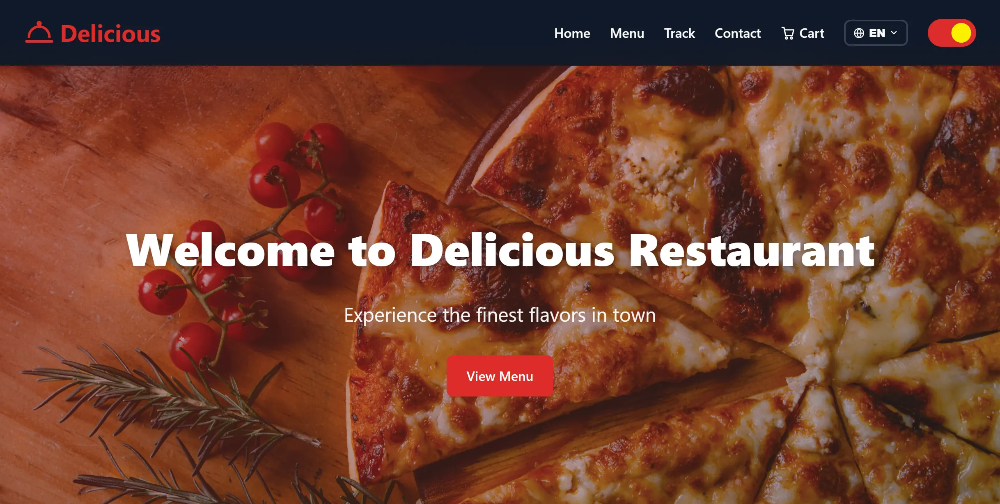 | 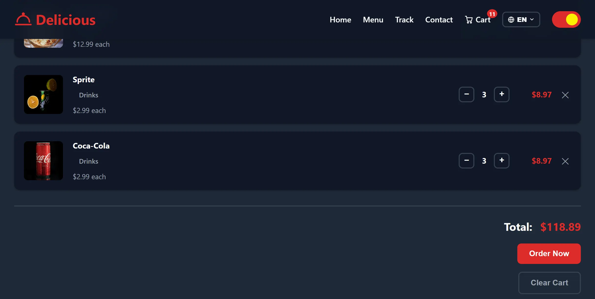 |
| Category filters + real-time search, extra ingredients (multi-pick) / drink sizes 30cl·1L·2L (single-pick) with live totals in EN/FR/AR, localStorage cart, fly-to-cart, Algerian phone validation (05/06/07 / +213) front + back, order-number deep-link confirmation | `#track` timeline pending → delivered, 30s auto-refresh (pauses when tab hidden), id + phone required, masked PII, `no-store`, generic "not found" (no enumeration), delivery zones + fees + free-over threshold + ETA |

| Kitchen & Admin | Security & Polish |
|---|---|
| 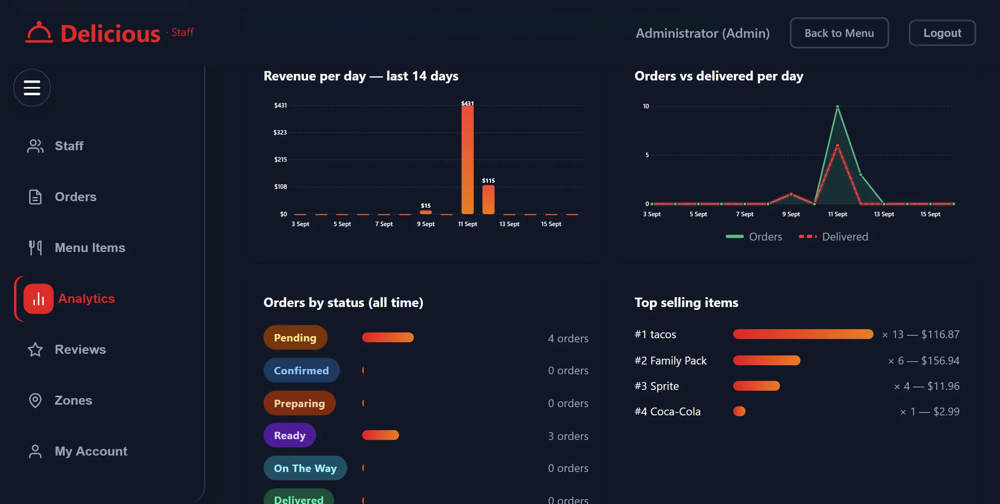 | 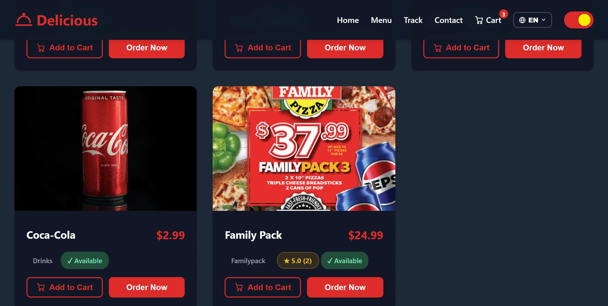 |
| Live kitchen feed (15s refresh, chime + flashing NEW, browser notifications, click-to-copy phone), staff/admin RBAC, menu manager (photo + priced EN/FR/AR options), zones, reviews, revenue cards with 7/14/30-day deltas, SVG charts, CSV export, delivered orders purged after 24h into `delivery_stats` (PII gone, revenue kept), zero admin code on the public page | httpOnly cookie + Bearer fallback, username-or-email login, IP rate limits + 5 fails → 15min lockout + 20 fails → 60min IP ban (persisted across restarts), Nodemailer 1h reset tokens, generic responses everywhere, EN/FR/AR globe menu + full RTL, auto-migrations on boot, env-tunable limits, dark/light theme |

### 2. 📝 TodoList — enterprise Kanban task manager
**[`project-todo.html`](./project-todo.html) · [Repo](https://github.com/ayoubcoding111/firstapp) · `Node.js · Express · MySQL · Vanilla JS · JWT · bcrypt`**

| Kanban Board | Auth & Experience |
|---|---|
| 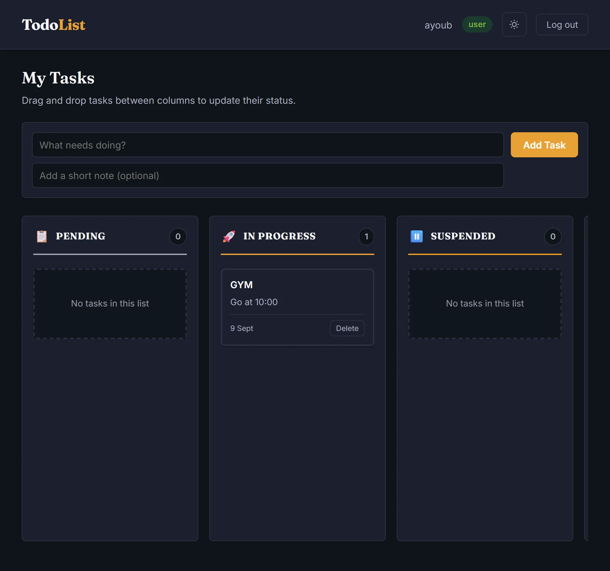 | 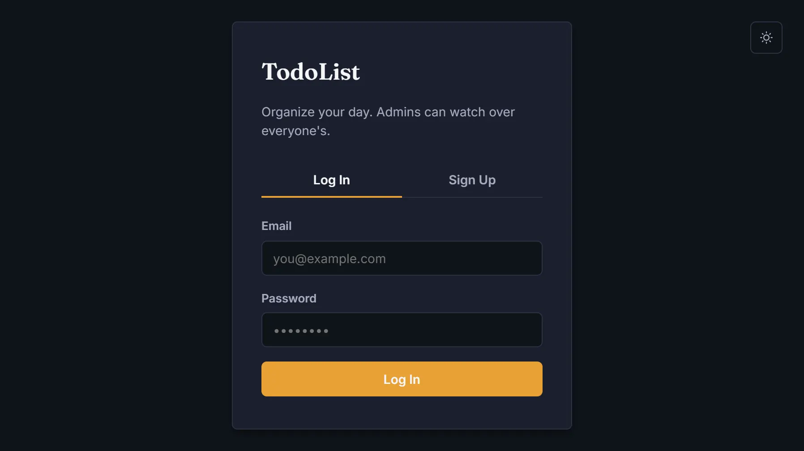 |
| Native HTML5 drag-and-drop across **Pending → In Progress → Suspended → Finished**, column highlighting, card animations, task counts, optimistic MySQL sync (`PATCH /api/todos/:id/status`), full CRUD + descriptions + timestamps | JWT sessions, bcrypt 10 rounds, RBAC middleware, parameterized SQL, CORS + env secrets, CSS-variable theming with localStorage persistence, Fraunces + Inter type, staggered animations, login/register tabs, protected routes |

| Admin Oversight | Craft Details |
|---|---|
| 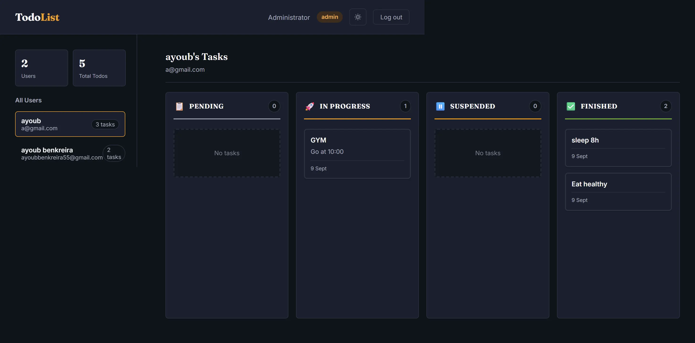 | 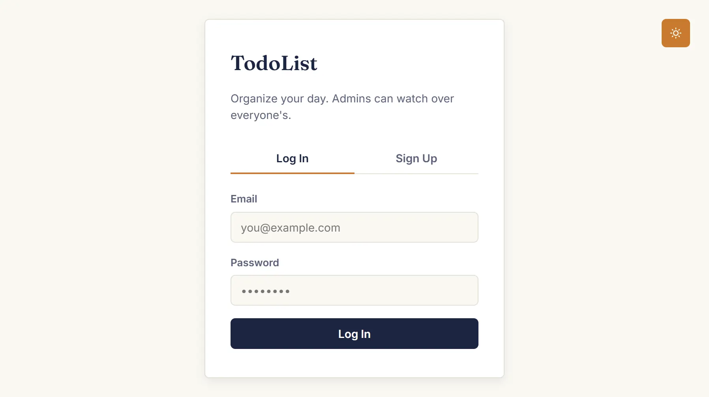 |
| One clean view of every user's board, per-user drill-down, real-time user + task metrics, `GET /api/admin/users`, modular controllers/routes/middleware, ESLint-ready | Demo login `admin@todo.com / Admin123!`, schema + Kanban migration, `.env.example`, statically-served frontend, light + dark login on one component system. Roadmap: due dates, tags, search, 2FA, Socket.io, exports |

### 3. 🦷 Pacific Dental Clinic — bilingual FR/AR clinic site
**[`project-dentiste.html`](./project-dentiste.html) · [Repo](https://github.com/ayoubcoding111/Dentiste) · `HTML5 · CSS3 · Vanilla JS · i18n FR/AR · RTL · SEO` — <100KB, zero dependencies, zero build**

| Hero & Trust | Treatments |
|---|---|
| 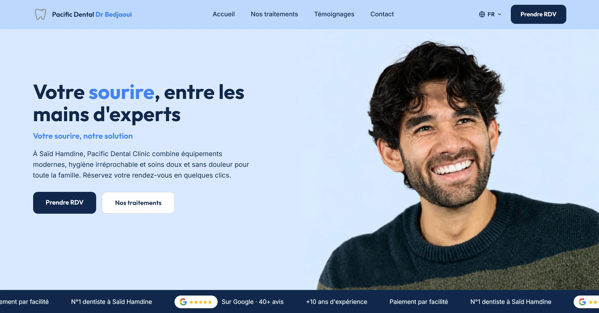 | 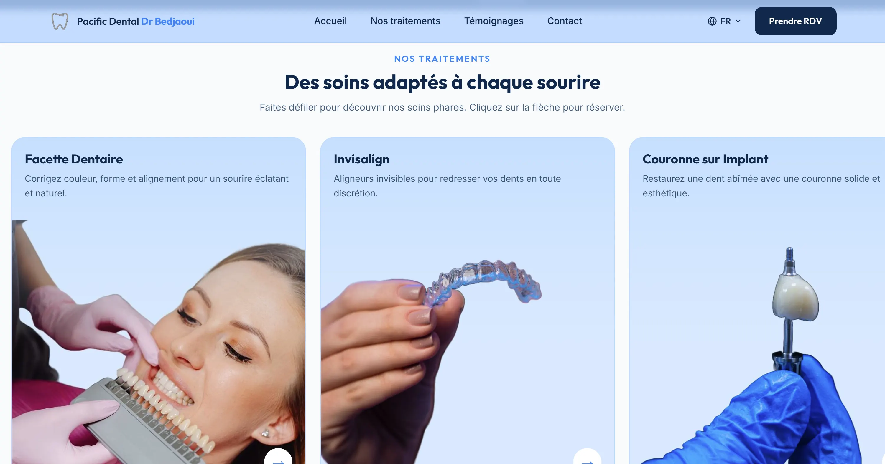 |
| Calm high-contrast hero, CTA smooth-scrolls + autofocuses booking form, infinite trust ticker (5/5 Google · 10+ years · installments · local N°1), GPU marquee, `clamp()` fluid type, glass nav | Custom infinite carousel engine (no library): veneers, Invisalign, implant crowns, implants — 3 virtual sets, snap-safe arrows, swipe settling, hover elevation, every card jumps into booking |

| Clinical Proof | Social Proof |
|---|---|
| 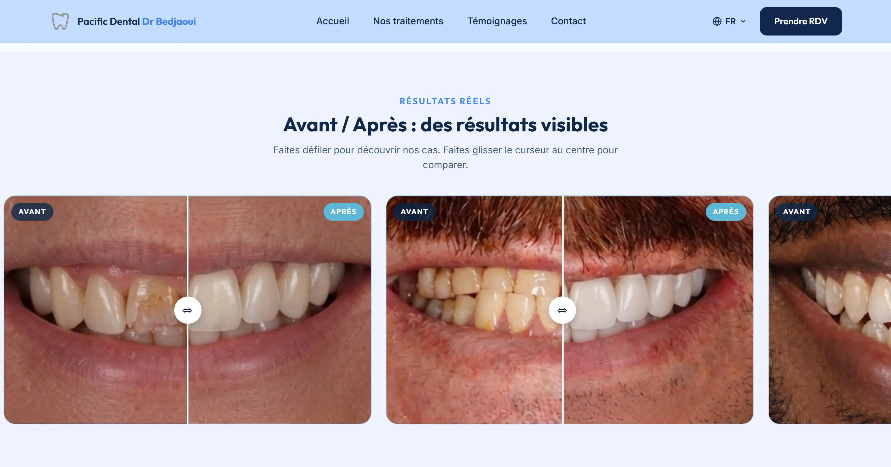 | 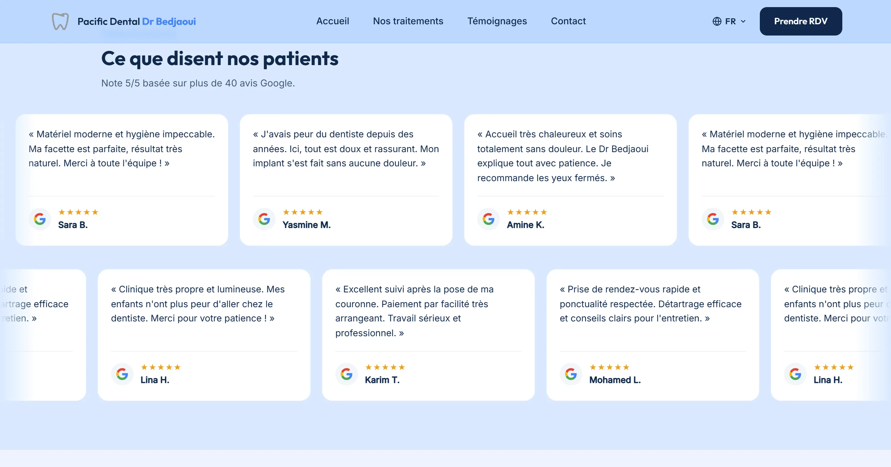 |
| Interactive **Avant / Après slider** — mouse, touch, keyboard + pointer capture on a single CSS var at 60fps, hardware-accelerated clip-path, zero layout shift | Real Google stories on **two staggered infinite tracks**, JS-duplicated 4× for seamless any-viewport loops, GPU `translateX`, zero dropped frames |

| Clinic Tour | Booking | Bilingual & Location |
|---|---|---|
| 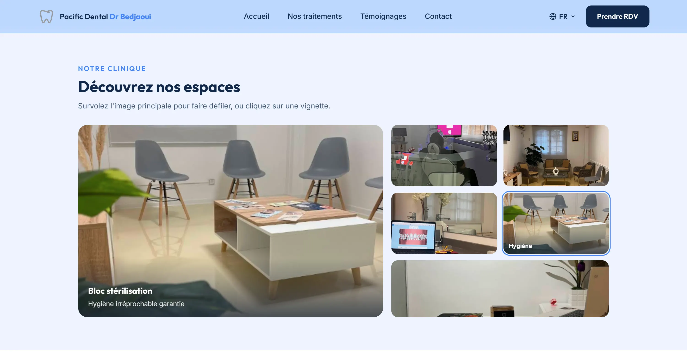 | 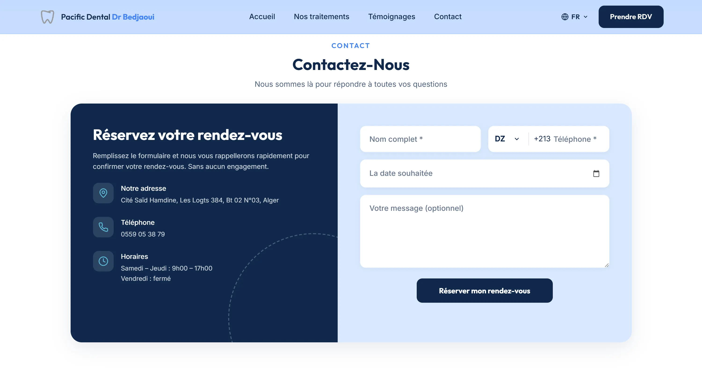 | 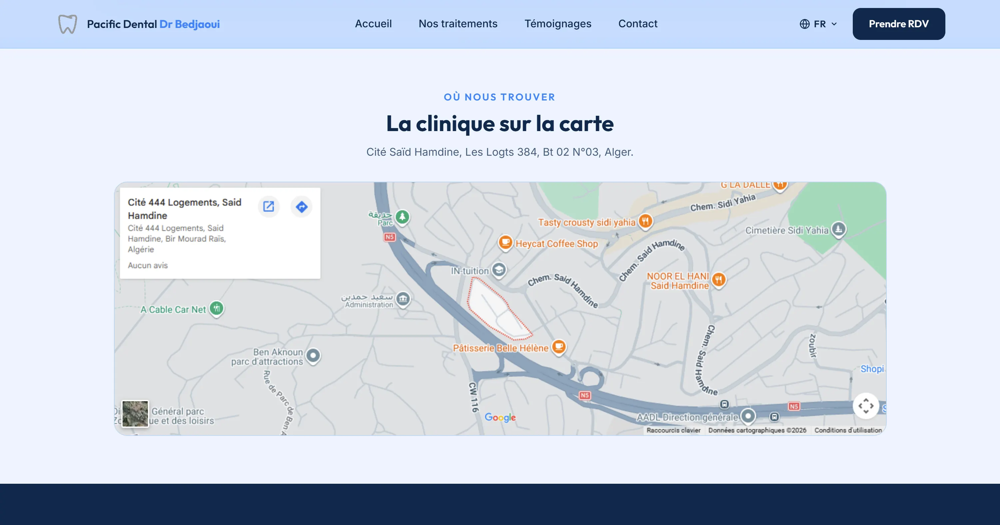 |
| Suites, lounges, sterilization units — hover auto-cycles (1200ms), click locks view, FR/AR-synced captions | DZ +213 prefix selector, numeric sanitizing, native date picker on tap, instant localized confirmations, direct-call link, Sat–Thu 9:00–17:00 | Instant `data-fr / data-ar` toggle, zero reload — flips `dir`/`lang`, reflows nav/forms/gallery, syncs placeholders + aria-labels + SEO title, embedded Google Maps on Cité Saïd Hamdine |

---

## 🧰 Tech stack

| Layer | Choices |
|---|---|
| Markup / Style / Logic | Semantic **HTML5** · hand-written **CSS3** (tokens, custom properties, no framework) · **Vanilla JS** (`script.js`, ~1080 lines) |
| Motion | **Lenis** smooth scroll (CDN, graceful fallback) · IntersectionObserver reveals · CSS keyframe entrances · canvas-free video loop |
| Markdown | **marked** + **DOMPurify** for live GitHub README rendering |
| Media | **WebP-only** screenshots (`assets/*.webp`) + MP4 hero via `cdn.sceneai.art` · lazy loading + async decoding |
| Forms / Comms | **Calendly** booking · `mailto:` CTA · **Discord webhook** quote pipeline |
| Fonts / Icons | **Inter** (Google Fonts) · inline SVG icon system · Devicon / SimpleIcons CDN marquee |
| i18n | EN/FR/AR content + full **RTL** reflow (showcased builds) |
| Tooling | **Zero build step** — no bundler, no framework, no install. `Live Server` port `5501` (`.vscode/settings.json`) |

---

## 🚀 Quick start

```bash
# 1. Clone
git clone https://github.com/<you>/codsec.git
cd codsec

# 2. Run — pick one, no install needed
open index.html
# or
python -m http.server 8000      # → http://localhost:8000
# or VS Code → Go Live (port 5501, see .vscode/settings.json)
```

Pages: `index.html` (home) · `project-restaurant.html` · `project-todo.html` · `project-dentiste.html` · `contact.html` (quote form) · `privacy.html`

> The Discord webhook URL in `script.js` (`initQuoteForm`) is public frontend code by design. If it gets spammed, regenerate it in Discord → Channel Settings → Integrations → Webhooks and replace `DISCORD_WEBHOOK_URL`.

---

## 📁 Project structure

```
codsec/
├── index.html               # Home: hero, services, marquee, process, about, projects, FAQ, contact
├── project-restaurant.html  # Detail: ordering platform (ordering, tracking, kitchen/admin, security)
├── project-todo.html        # Detail: Kanban manager (board, auth, admin, craft notes)
├── project-dentiste.html    # Detail: bilingual clinic (hero, treatments, slider, reviews, gallery, booking, map)
├── contact.html             # Quote funnel: multi-dropdown form → Discord webhook embed
├── privacy.html             # Privacy policy
├── styles.css               # Full design system (~3224 lines: tokens, panels, galleries, timelines, forms, RTL)
├── script.js                # All interactions (~1080 lines: words, Lenis, spy, rail, galleries, cursor, README, team, FAQ, form)
└── assets/                  # WebP screenshots + mylogo (favicon + brand mark)
    ├── hero.webp / menu.webp / cart.webp / analytics.webp
    ├── login-dark.webp / login-light.webp / user-dashboard.webp / admin-dashboard.webp
    ├── dentiste-1.webp … dentiste-7.webp
    └── mylogo.webp / mylogo.png
```

---

## 📊 Performance & accessibility choices

- **WebP everywhere**, `loading="lazy"`, `decoding="async"`, preloaded gallery probes only on intent
- Video uses **native `loop`** (no frame capture / canvas rAF) + pauses when tab hidden
- `prefers-reduced-motion` respected across scroll, reveals, counters, galleries, cursor
- Semantic landmarks, labelled nav/menus, `aria-expanded` menus + FAQ, focusable galleries with keyboard paths, visible focus states
- Preconnects for fonts/video CDN, `preload="metadata"` on hero video, deferred CDN scripts

---

## 🗺️ Roadmap

- [ ] Case-study metrics (conversion lift, Lighthouse scores) per project
- [ ] EN/FR/AR toggle on the agency site itself (builds already prove the engine)
- [ ] Blog / build-notes section feeding the same live-README renderer
- [ ] Server-side quote endpoint (replace public Discord webhook) + honeypot + rate limiting
- [ ] OG images + per-page social cards

---

## 🤝 Work with me

- 📅 **Free 15-min discovery call:** [calendly.com/ayoubbenkreira55/new-meeting](https://calendly.com/ayoubbenkreira55/new-meeting)
- 📩 **Quote form:** [`contact.html`](./contact.html) — fixed quote, reply within 24 hours
- ✉️ **Email:** [ayoubecom111@gmail.com](mailto:ayoubecom111@gmail.com?subject=Project%20for%20CodSec)
- 🐙 **GitHub:** [ayoubcoding111](https://github.com/ayoubcoding111)

---

<div align="center">

**CodSec — Build Strong, Build Smart.**

*© <span>2026</span> CodSec. All rights reserved. · [Privacy](./privacy.html) · [Contact](./contact.html)*

</div>
